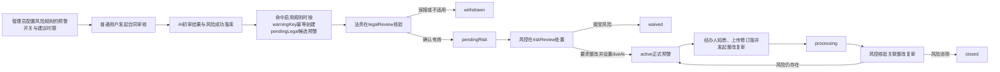

# A24 基于大模型的企业合同智能审核与风险预警系统

| 项目名称 | A24 基于大模型的企业合同智能审核与风险预警系统 |
|---|---|
| 文档名称 | 需求与功能清单 |
| 文档版本 | V0.1 |
| 文档状态 | 开发基线 |
| 创建日期 | 2026-07-11 |
| 主要负责人 | 项目组（王崇哲、刘紫雯、杨雨翰） |
| 参与人员 | 前端：王崇哲；AI算法：刘紫雯；后端：杨雨翰 |

## 修订记录

| 版本 | 日期 | 说明 | 修订人 |
|---|---|---|---|
| V0.1 | 2026-07-11 | 建立开发前需求基线 | 杨雨翰 |
| V0.1-r1 | 2026-07-11 | 调整四角色审核权限与人工复核流程 | 杨雨翰 |
| V0.1-r2 | 2026-07-19 | 补充 M3.3 风险预警与处置闭环设计（待开发） | 杨雨翰 |

## 1. 项目背景与目标

赛题面向企业法务与风控部门。合同数量、格式和条款差异持续增加，纯人工逐条审核效率低且易遗漏。本系统以“人机协同审核”为定位：用户上传 DOCX、PDF 或图片合同后，系统完成文本解析、合同类型识别、关键要素抽取、风险条款识别、标准条款比对、报告生成及反馈标注。

目标是交付可演示的 Web 系统，形成可复核的结构化审核结果，不替代法务最终判断。赛题要求的分类准确率、要素抽取 F1、风险识别精准率/召回率均是**待测试集评测的目标值**，不得表述为已实现效果。

## 2. 用户与权限

| 角色 | 权限范围 |
|---|---|
| 普通用户（`user`） | 合同经办人员：登录、上传本人合同、发起审核、查看本人合同的进度/AI初审结果/最终结果、查询历史、下载已完成报告、按审核意见补充或重新上传合同；不修改审核结果或提交标注 |
| 法务审核员（`legalReviewer`） | 查看待法务复核合同及原文、AI初审结果；复核并修改合同类型、关键要素和法律风险，提交正确/错误/已修订标注、法务意见并完成法务审核 |
| 风控审核员（`riskReviewer`） | 查看法务复核后的合同、AI初审结果和法务结果；复核总体风险等级/分数，确认、修订或忽略风险记录，提交标注、最终风控意见并确认最终结果 |
| 管理员（`admin`） | 管理用户、标准条款模板、风险规则、合同与审核记录；查看统计、反馈与运行日志，不默认作为合同审核人员 |

普通用户的数据范围为本人合同；法务和风控审核操作仅由对应角色执行。普通用户不得修改 AI初审结果、风险结果或写入审核标注。

审核权限必须由后端按 `reviewStage` 验证：AI初审保存后进入 `legalReview`，仅法务可修订合同类型、要素和法律风险并提交意见；法务确认后进入 `riskReview`，仅风控可修订风险状态、总体风险等级/分数并提交最终意见；风控确认后才进入 `completed`。管理员可以读取全量审核记录和管理配置，但不具备任一审核确认或修订权限。AI初审原始结果不可覆盖，所有人工修订和反馈必须保留操作者、角色、阶段、前后值与时间。

### M3.3 预警角色边界（设计待开发）

预警规则由管理员在合同审核前配置，但某份合同的具体预警只在 AI 初审成功落库、识别到命中且启用预警的风险规则后创建；它首先是仅法务可见的候选预警，不是对合同在审核前报警。法务仅在 `legalReview` 阶段核验 `pendingLegal` 候选预警，确认有效后转为 `pendingRisk`，误报或不适用则撤回为 `withdrawn`。风控仅在 `riskReview` 阶段决定要求整改或书面接受风险：前者形成 `active` 正式预警并设置 `dueAt`，后者为 `waived`。普通用户仅可查看本人 `active` 或 `processing` 预警、确认知悉、上传修订版合同并发起整改复审；不得创建、撤销、豁免或关闭预警。风控仅能在关联整改复审已完成后关闭为 `closed`，风险仍存在则重开为 `active`。管理员维护预警规则、查看统计和日志，但不得代替法务或风控处置预警。

## 3. 业务流程

## 4. 功能模块与优先级

| 模块 | 功能 | 优先级 | 验收要点 |
|---|---|---:|---|
| 认证与权限 | 登录、JWT、四类角色及数据权限 | Must | 未登录不可访问受保护资源；普通用户无审核/标注权限；管理员权限受控 |
| 合同管理 | DOCX/PDF/图片上传、文件校验、列表、详情、逻辑删除 | Must | 支持三类格式并保留原文件信息 |
| 审核任务 | 发起、状态查询、失败重试提示 | Must | 状态可追踪：待处理、处理中、成功、失败 |
| 文档理解 | 解析、OCR、段落与页码定位 | Must | 结果保留页码、段落索引或等效位置 |
| 类型与要素 | 至少五类合同识别；抽取五项必需元素 | Must | 输出结构化值、置信度和位置 |
| 风险审核 | 至少十类风险、等级、依据、建议 | Must | 每条风险有原文、位置、依据、建议 |
| 风险预警与处置闭环 | 预警规则、候选预警、法务核验、风控处置、整改复审、关闭留痕 | Must | 规则先配置；候选预警在 AI 初审风险成功落库后幂等创建；正式预警仅基于人工核验后的 `effectiveResult`；首版设计范围为站内预警中心、审核员待办和 Dashboard |
| 标准条款 | 模板/条款配置、比对、缺失提醒 | Must | 管理员可维护，审核可返回缺失项 |
| 审核结果 | AI初审结果、法务/风控复核结果、正确/错误标注 | Must | 仅法务和风控审核员可修订或标注，修改和反馈均留痕 |
| 报告与历史 | HTML/PDF报告、下载、历史查询 | Must | 报告包含赛题指定字段 |
| 可视化 | Dashboard 风险分布、审核量统计 | Should | 使用 ECharts，数据与权限一致 |
| 对话式改写、印章/签名检查、知识图谱 | 创新项 | Could | 本版本不承诺实现 |

## 5. MVP范围

MVP 覆盖全部 Must 功能，采用规则库与 Qwen API 组合识别风险；支持采购合同、销售合同、保密协议、服务外包合同、劳动合同。仅支持异步审核任务，不建设实时协同编辑、工作流审批、模型训练平台或多租户隔离。表中的 M3.3 风险预警与处置闭环是后续 Must 设计项，当前仅完成设计补充，不表示已实现、已部署或已验收。

## 6. 赛题要求映射

| 赛题要求 | 系统设计落点 | 验证状态 |
|---|---|---|
| 至少5类合同，分类准确率目标≥85% | `contractType` 字典、AI分类接口、评测记录 | 目标值，待测试集评测 |
| 五项要素，F1目标≥80% | `contract_element`、要素抽取结果 | 目标值，待测试集评测 |
| 至少10类风险，精准率/召回率目标≥75% | 风险字典、规则库、`risk_record` | 目标值，待测试集评测 |
| 结构化报告 | 报告接口与 `report` 表 | 开发验收项 |
| Web、上传、结果、导出、反馈 | Vue3 页面与 REST API | 开发验收项 |

## 7. 非功能需求与验收

| 类别 | 基线要求 |
|---|---|
| 安全 | HTTPS 由 Nginx 终止；JWT 鉴权；密钥仅存环境变量；上传类型、大小和访问权限校验 |
| 可解释性 | 风险必须提供条款原文、页码/段落、规则或模型依据、修改建议与置信度 |
| 可用性 | 任务失败可见失败原因；上传、审核和导出有明确状态反馈 |
| 性能 | V0.1 不承诺固定吞吐量；记录 `processingTimeMs`，以压测结果确定SLA |
| 可维护性 | 前端、业务后端、AI服务分离；AI服务不直接访问业务数据库 |
| 数据质量 | 所有外部 JSON 使用 lowerCamelCase；枚举、字段名和错误码以文档为准 |

## 8. M3.3 风险预警与处置闭环（设计待开发）

M3.3 在既有合同审核业务管理与平台运营管理中增补站内预警中心、审核员待办和 Dashboard 展示，不新增独立预警服务、消息队列或外部通知服务。AI 服务继续只输出风险证据和结构化初审结果，不决定正式预警、整改、豁免或关闭等业务状态。

候选预警保存不可变的 AI 风险与规则快照，仅供法务核验；面向经办人的正式预警必须来自法务、风控核验后的 `effectiveResult`，不得把 AI 原始快照直接展示为最终预警。`overdue` 是派生布尔值：仅当 `warningStatus` 为 `active` 或 `processing` 且 `dueAt` 已超过当前时间时为 `true`，不覆盖或改变原有状态。

`warningStatus` 固定为：`pendingLegal`（AI 初审命中规则后的法务候选）、`pendingRisk`（法务确认有效后等待风控处置）、`active`（风控要求整改后的正式预警）、`processing`（经办人已发起整改复审）、`closed`（风控确认风险消除）、`withdrawn`（法务撤回误报或不适用候选）和 `waived`（风控书面接受风险）。除上述状态外不得以“逾期”替代原状态。

## 9. 暂不实现与TBD

| 项目 | 原因/后续条件 |
|---|---|
| 多轮对话式修改建议 | 属于赛题鼓励创新项，MVP后评估 |
| 印章、签名合规检查 | 需额外视觉模型和标注样本 |
| 知识图谱跨条款分析 | 需明确业务本体与样本 |
| 模型训练/微调 | MVP阶段暂不进行模型微调，优先采用Qwen API、Prompt工程与规则库；后续根据评测结果决定是否微调 |
| 评测集和最终指标 | 由团队建立测试集后评测，禁止预填结果 |
| 短信、邮件、企业微信、钉钉通知 | M3.3 首版仅提供站内预警中心、审核员待办和 Dashboard 展示；外部消息通知待后续确认通知渠道、模板、频率和审计要求后再设计 |
