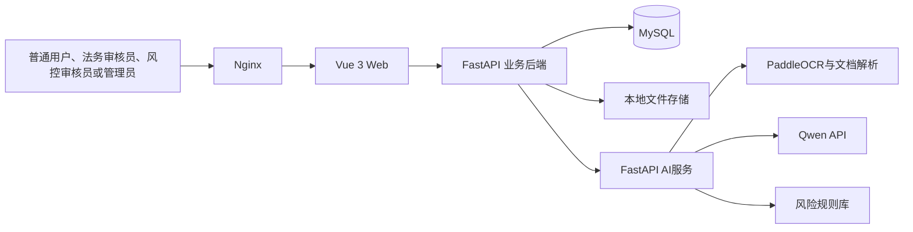
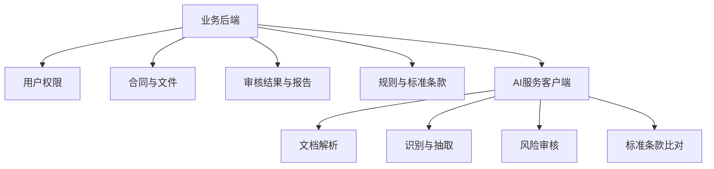
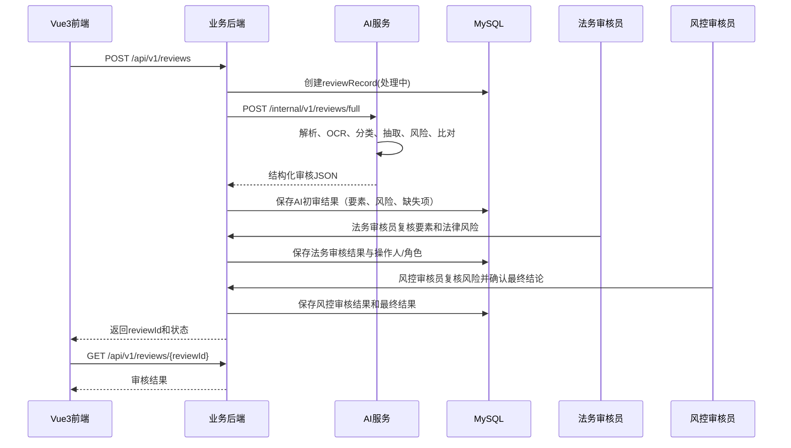

# A24 基于大模型的企业合同智能审核与风险预警系统

| 项目名称 | A24 基于大模型的企业合同智能审核与风险预警系统 |
|---|---|
| 文档名称 | 系统架构设计 |
| 文档版本 | V0.1 |
| 文档状态 | 开发基线 |
| 创建日期 | 2026-07-11 |
| 主要负责人 | 项目组（王崇哲、刘紫雯、杨雨翰） |
| 参与人员 | 前端：王崇哲；AI算法：刘紫雯；后端：杨雨翰 |

## 修订记录

| 版本 | 日期 | 说明 | 修订人 |
|---|---|---|---|
| V0.1 | 2026-07-11 | 建立三服务分离架构基线 | 杨雨翰 |
| V0.1-r1 | 2026-07-11 | 补充四角色权限与人工复核时序 | 杨雨翰 |

## 1. 架构目标

以最少的服务实现可部署、可追溯的合同审核闭环：前端仅调用业务后端；业务后端负责认证、权限、任务编排和持久化；AI 服务仅处理文件与返回结构化审核结果，**不直接操作 MySQL**。

## 2. 总体架构



## 3. 技术栈

| 层 | 固定技术 |
|---|---|
| 前端 | Vue 3、Vite、TypeScript、Element Plus、Pinia、Vue Router、Axios、ECharts |
| 业务后端 | Python 3.11+、FastAPI、Pydantic、SQLAlchemy、Alembic、MySQL、JWT、Uvicorn |
| AI服务 | Python、FastAPI、PaddleOCR、pdfplumber 或 PyMuPDF、python-docx、Qwen API、Prompt工程、规则库 |
| 部署 | Docker、Docker Compose、Nginx |

## 4. 职责边界与模块关系

| 组件 | 负责 | 不负责 |
|---|---|---|
| Vue3前端 | 页面、表单、结果展示、可视化、调用业务API | 直连AI服务、直连Qwen、持久化业务数据 |
| 业务后端 | JWT、四角色RBAC、文件元数据、任务、规则/模板管理、AI初审结果与人工复核结果保存、报告；普通用户仅操作本人合同，法务/风控仅执行对应复核操作，修改和标注记录操作人及角色 | OCR和大模型推理实现 |
| AI服务 | 解析/OCR、分类、抽取、风险识别、比对、结构化JSON | 用户认证、业务数据库写入 |
| MySQL | 业务元数据、审核结果、反馈、报告记录、日志 | 原始大文件和模型密钥 |



## 5. 分层设计与目录建议

业务后端分为 API、application（用例/任务编排）、domain（实体与规则）、infrastructure（SQLAlchemy、文件、AI客户端）层；AI服务分为 API、parser、ocr、pipeline、rules、llm、schemas 层。建议目录：

```text
frontend/                 # Vue3
backend/app/{api,application,domain,infrastructure,models,schemas}/
ai-service/app/{api,parser,ocr,pipeline,rules,llm,schemas}/
storage/{uploads,reports}/
deploy/{nginx}/
docs/
```

## 6. 合同审核调用流程



## 7. 关键流程与异常处理

文件上传时业务后端校验格式、大小、所有者并持久化文件元数据；AI服务通过内部受控路径读取文件。解析失败、OCR不可用、Qwen超时、返回JSON校验失败均写入审核任务失败状态和可读错误码。AI调用使用 `requestId` 幂等键；仅对网络超时和可恢复 5xx 重试，禁止对参数错误盲目重试。

认证使用 Bearer JWT，后端校验签名、过期时间及角色；管理员接口做角色校验。普通用户仅访问本人合同且不能修改AI初审结果或提交标注；法务审核员仅执行法务复核，风控审核员仅执行风险复核。上传文件按合同所属人授权下载，路径不得由客户端直接指定。日志不得写入密码、JWT、Qwen API Key 或完整敏感合同正文。

## 8. 可扩展性

V0.1 保持单个业务后端和单个 AI 服务，审核任务以数据库状态管理。需要并发扩展时再引入队列/worker；需要对象存储时再替换本地文件适配层。此处不预置微服务注册中心、消息总线或复杂编排，避免超出赛题范围。
