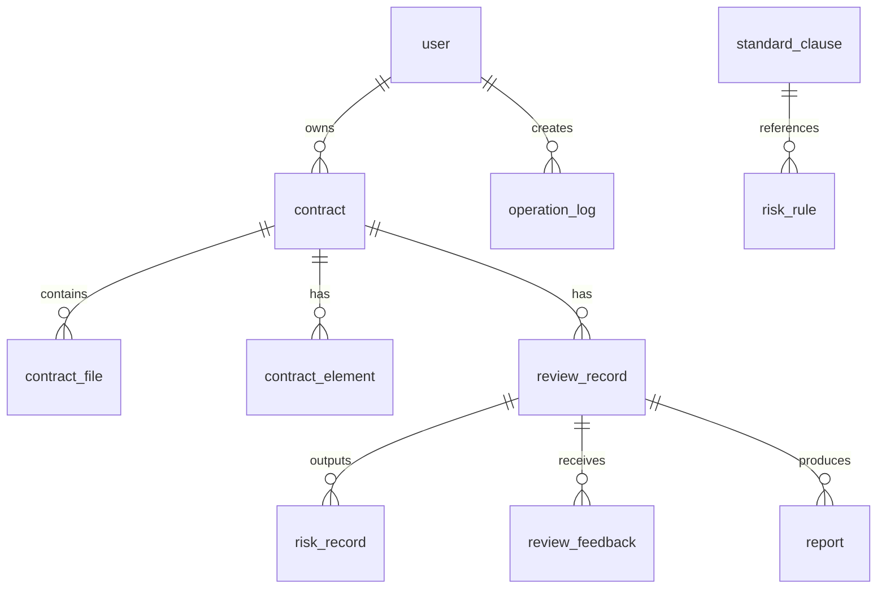

# A24 基于大模型的企业合同智能审核与风险预警系统

| 项目名称 | A24 基于大模型的企业合同智能审核与风险预警系统 |
|---|---|
| 文档名称 | 数据库设计 |
| 文档版本 | V0.1 |
| 文档状态 | 开发基线 |
| 创建日期 | 2026-07-11 |
| 主要负责人 | 后端负责人：杨雨翰 |
| 参与人员 | AI算法负责人：刘紫雯；前端负责人：王崇哲 |

## 修订记录

| 版本 | 日期 | 说明 | 修订人 |
|---|---|---|---|
| V0.1 | 2026-07-11 | 建立 MySQL 逻辑模型 | 杨雨翰 |
| V0.1-r1 | 2026-07-11 | 补齐缺失条款持久化并统一风险规则字段 | 杨雨翰 |

## 1. 约定

MySQL 8.0+，表名采用 snake_case；主键使用 `bigint unsigned`；时间使用 `datetime(3)`（UTC）；金额使用 `decimal(18,2)`；枚举值见《06-数据字典》。所有业务表含 `created_at`、`updated_at`；可删除业务数据含 `deleted_at`，查询必须过滤 `deleted_at is null`。



## 2. 表定义

| 表名（中文） | 用途 | 核心字段 | 索引/唯一约束 |
|---|---|---|---|
| `user`（用户） | 账号、角色、状态 | `id bigint PK`、`username varchar(64) not null`、`password_hash varchar(255) not null`、`role varchar(20) not null`、`status varchar(20) not null default 'active'` | `uk_user_username(username)`；`idx_user_role_status(role,status)` |
| `contract`（合同） | 合同业务主记录 | `id bigint PK`、`owner_id bigint FK not null`、`name varchar(255) not null`、`contract_type varchar(40) null`、`status varchar(20) not null default 'uploaded'`、`deleted_at datetime(3) null` | `idx_contract_owner_status(owner_id,status)`；`idx_contract_type(contract_type)` |
| `contract_file`（合同文件） | 原文件元数据 | `id bigint PK`、`contract_id bigint FK not null`、`file_name varchar(255)`、`storage_path varchar(500)`、`file_type varchar(20)`、`file_size bigint`、`sha256 char(64)` | `uk_file_contract_sha(contract_id,sha256)`；`idx_file_contract(contract_id)` |
| `contract_element`（合同要素） | AI抽取/用户修订要素 | `id bigint PK`、`contract_id bigint FK`、`review_id bigint FK null`、`element_type varchar(40)`、`value_text text`、`page int null`、`paragraph_index int null`、`confidence decimal(5,4) null`、`source varchar(20)` | `idx_element_contract_type(contract_id,element_type)` |
| `review_record`（审核记录） | 审核任务及汇总结果 | `id bigint PK`、`contract_id bigint FK`、`request_id varchar(64)`、`status varchar(20)`、`missing_clauses json`、`overall_risk_level varchar(10) null`、`overall_score decimal(5,2) null`、`processing_time_ms int null`、`error_code varchar(32) null` | `uk_review_request(request_id)`；`idx_review_contract_created(contract_id,created_at)` |
| `risk_record`（风险记录） | 每条风险发现 | `id bigint PK`、`review_id bigint FK`、`rule_id bigint null`、`risk_type varchar(40)`、`risk_name varchar(100)`、`risk_level varchar(10)`、`clause_text text`、`page int null`、`paragraph_index int null`、`basis text`、`suggestion text`、`confidence decimal(5,4) null` | `idx_risk_review_level(review_id,risk_level)`；`idx_risk_type(risk_type)` |
| `standard_clause`（标准条款） | 管理员维护的模板条款 | `id bigint PK`、`name varchar(100)`、`contract_type varchar(40)`、`clause_type varchar(40)`、`content text`、`status varchar(20) default 'active'` | `uk_clause_type_name(contract_type,clause_type,name)` |
| `risk_rule`（风险规则） | 风险规则及阈值 | `id bigint PK`、`rule_code varchar(40)`、`risk_type varchar(40)`、`name varchar(100)`、`risk_level varchar(10)`、`rule_content text`、`standard_clause_id bigint null`、`status varchar(20)` | `uk_rule_code(rule_code)`；`idx_rule_type_status(risk_type,status)` |
| `review_feedback`（审核反馈） | 正误标注及修订意见 | `id bigint PK`、`review_id bigint FK`、`risk_id bigint null`、`user_id bigint FK`、`judgment varchar(20)`、`corrected_value text null`、`comment text null` | `idx_feedback_review(review_id)` |
| `report`（报告） | 报告生成与文件位置 | `id bigint PK`、`review_id bigint FK`、`format varchar(10)`、`status varchar(20)`、`storage_path varchar(500) null`、`generated_at datetime(3) null` | `uk_report_review_format(review_id,format)` |
| `operation_log`（操作日志） | 安全与管理操作留痕 | `id bigint PK`、`user_id bigint null`、`action varchar(80)`、`resource_type varchar(40)`、`resource_id bigint null`、`detail_json json null`、`ip varchar(45) null` | `idx_log_user_created(user_id,created_at)`；`idx_log_resource(resource_type,resource_id)` |

## 3. 关系、删除和审计策略

`contract` 删除采用逻辑删除，不物理删除其文件、审核和报告；`review_record`、`risk_record`、`contract_element` 作为审核证据保留。用户禁止物理删除，停用以 `status=disabled` 表示。规则和标准条款采用状态停用，既有审核结果保留当时的规则编号与文案快照。外键用于完整性：文件、要素、审核记录、风险、反馈、报告均引用父记录；实际迁移中按依赖顺序建表。

审计字段由 ORM/数据库默认值维护；敏感操作额外写入 `operation_log`。不将原始合同正文、密码或API密钥放入日志。

## 4. 字段明细

记号：`NN`=不允许为空，`N`=允许为空，`PK`=主键，`FK`=外键。除非特别写明，每表均有 `created_at datetime(3) NN`、`updated_at datetime(3) NN`，默认由应用写入当前UTC时间。

| 表 | 字段（类型；空值；默认；约束/说明） |
|---|---|
| `user` | `id bigint unsigned; NN; auto; PK`；`username varchar(64); NN; -; 唯一登录名`；`password_hash varchar(255); NN; -; 密码哈希`；`role varchar(20); NN; user; 角色`；`status varchar(20); NN; active; 用户状态`；`deleted_at datetime(3); N; null; 逻辑删除` |
| `contract` | `id bigint unsigned; NN; auto; PK`；`owner_id bigint unsigned; NN; -; FK user.id`；`name varchar(255); NN; -; 合同名称`；`contract_type varchar(40); N; null; 合同类型`；`status varchar(20); NN; uploaded; 合同状态`；`deleted_at datetime(3); N; null; 逻辑删除` |
| `contract_file` | `id bigint unsigned; NN; auto; PK`；`contract_id bigint unsigned; NN; -; FK contract.id`；`file_name varchar(255); NN; -; 原文件名`；`storage_path varchar(500); NN; -; 受控存储路径`；`file_type varchar(20); NN; -; 文件类型`；`file_size bigint unsigned; NN; -; 字节数`；`sha256 char(64); NN; -; 内容摘要` |
| `contract_element` | `id bigint unsigned; NN; auto; PK`；`contract_id bigint unsigned; NN; -; FK contract.id`；`review_id bigint unsigned; N; null; FK review_record.id`；`element_type varchar(40); NN; -; 要素类型`；`element_name varchar(80); NN; -; 中文名`；`value_text text; NN; -; 提取值`；`page int unsigned; N; null; 页码`；`paragraph_index int unsigned; N; null; 段落索引`；`confidence decimal(5,4); N; null; 0至1`；`source varchar(20); NN; ai; 来源` |
| `review_record` | `id bigint unsigned; NN; auto; PK`；`contract_id bigint unsigned; NN; -; FK contract.id`；`request_id varchar(64); NN; -; 幂等调用号`；`status varchar(20); NN; pending; 审核状态`；`missing_clauses json; NN; 应用写入[]; 缺失条款类型数组`；`overall_risk_level varchar(10); N; null; 总体风险级别`；`overall_score decimal(5,2); N; null; 0至100风险分`；`processing_time_ms int unsigned; N; null; 耗时`；`error_code varchar(32); N; null; 错误码`；`error_message varchar(500); N; null; 安全错误摘要` |
| `risk_record` | `id bigint unsigned; NN; auto; PK`；`review_id bigint unsigned; NN; -; FK review_record.id`；`rule_id bigint unsigned; N; null; FK risk_rule.id`；`risk_type varchar(40); NN; -; 风险类型`；`risk_name varchar(100); NN; -; 风险名称`；`risk_level varchar(10); NN; -; 风险等级`；`clause_text text; NN; -; 条款原文`；`page int unsigned; N; null; 页码`；`paragraph_index int unsigned; N; null; 段落索引`；`basis text; NN; -; 依据`；`suggestion text; NN; -; 修改建议`；`confidence decimal(5,4); N; null; 0至1`；`status varchar(20); NN; active; 修订状态` |
| `standard_clause` | `id bigint unsigned; NN; auto; PK`；`name varchar(100); NN; -; 条款名`；`contract_type varchar(40); NN; -; 适用合同类型`；`clause_type varchar(40); NN; -; 条款类别`；`content text; NN; -; 标准文案`；`status varchar(20); NN; active; 状态`；`version varchar(32); NN; v0.1; 条款版本` |
| `risk_rule` | `id bigint unsigned; NN; auto; PK`；`rule_code varchar(40); NN; -; 唯一规则号`；`risk_type varchar(40); NN; -; 风险类型`；`name varchar(100); NN; -; 规则名`；`risk_level varchar(10); NN; medium; 建议等级`；`rule_content text; NN; -; 规则内容`；`standard_clause_id bigint unsigned; N; null; FK standard_clause.id`；`status varchar(20); NN; active; 状态`；`version varchar(32); NN; v0.1; 规则版本` |
| `review_feedback` | `id bigint unsigned; NN; auto; PK`；`review_id bigint unsigned; NN; -; FK review_record.id`；`risk_id bigint unsigned; N; null; FK risk_record.id`；`user_id bigint unsigned; NN; -; FK user.id`；`judgment varchar(20); NN; -; 反馈判断`；`corrected_value text; N; null; 修订值`；`comment text; N; null; 说明` |
| `report` | `id bigint unsigned; NN; auto; PK`；`review_id bigint unsigned; NN; -; FK review_record.id`；`format varchar(10); NN; -; html或pdf`；`status varchar(20); NN; pending; 生成状态`；`storage_path varchar(500); N; null; 报告路径`；`generated_at datetime(3); N; null; 生成时间` |
| `operation_log` | `id bigint unsigned; NN; auto; PK`；`user_id bigint unsigned; N; null; FK user.id`；`action varchar(80); NN; -; 操作动作`；`resource_type varchar(40); NN; -; 资源类型`；`resource_id bigint unsigned; N; null; 资源ID`；`detail_json json; N; null; 脱敏详情`；`ip varchar(45); N; null; 来源IP` |

## 5. SQLAlchemy映射建议

一张表对应一个 SQLAlchemy Declarative 模型，字段使用 `Mapped[...]`，审计字段抽为轻量 `AuditMixin`。`Enum` 在 Python 层受《06-数据字典》约束，数据库以 `varchar` 保存以便赛题期间扩展。迁移仅通过 Alembic 生成和执行；模型变更须同步更新本文件、数据字典和接口。

示例建表片段：

```sql
CREATE TABLE review_record (
  id BIGINT UNSIGNED PRIMARY KEY AUTO_INCREMENT,
  contract_id BIGINT UNSIGNED NOT NULL,
  request_id VARCHAR(64) NOT NULL,
  status VARCHAR(20) NOT NULL,
  missing_clauses JSON NOT NULL,
  overall_risk_level VARCHAR(10) NULL,
  overall_score DECIMAL(5,2) NULL,
  processing_time_ms INT NULL,
  error_code VARCHAR(32) NULL,
  created_at DATETIME(3) NOT NULL,
  updated_at DATETIME(3) NOT NULL,
  UNIQUE KEY uk_review_request (request_id),
  KEY idx_review_contract_created (contract_id, created_at),
  CONSTRAINT fk_review_contract FOREIGN KEY (contract_id) REFERENCES contract(id)
);
```
