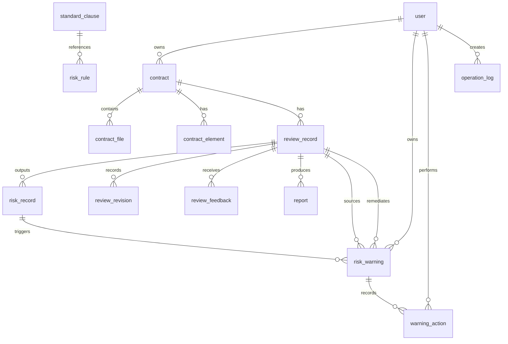

# A24 基于大模型的企业合同智能审核与风险预警系统

> M2.1 实现同步（2026-07-12）：`review_record` 在既有 `request_id`、`review_mode` 外，已通过 `20260712_0002` 增量迁移增加 `idempotency_user_id`、`idempotency_key`；通过 `20260712_0003` 增加 `ai_started_at`、`ai_attempt_count` 及 `idx_review_executor(status, review_stage, ai_started_at)`。`request_id` 是后端稳定生成并传给 AI 的请求号，不等同于客户端幂等键。

| 项目名称 | A24 基于大模型的企业合同智能审核与风险预警系统 |
|---|---|
| 文档名称 | 数据库设计 |
| 文档版本 | V0.1 |
| 文档状态 | 开发基线 |
| 创建日期 | 2026-07-11 |
| 主要负责人 | 后端负责人：杨雨翰 |
| 参与人员 | AI算法负责人：刘紫雯；前端负责人：王崇哲 |

## 修订记录

| 版本 | 日期 | 说明 | 修订人 |
|---|---|---|---|
| V0.1 | 2026-07-11 | 建立 MySQL 逻辑模型 | 杨雨翰 |
| V0.1-r1 | 2026-07-11 | 补齐缺失条款持久化并统一风险规则字段 | 杨雨翰 |
| V0.1-r2 | 2026-07-11 | 补充审核角色、审核人与标注权限说明 | 杨雨翰 |
| V0.1-r3 | 2026-07-19 | 补充 M3.3 风险预警与处置闭环逻辑模型（待开发） | 杨雨翰 |

## 1. 约定

MySQL 8.0+，表名采用 snake_case；主键使用 `bigint unsigned`；时间使用 `datetime(3)`（UTC）；金额使用 `decimal(18,2)`；枚举值见《06-数据字典》。所有业务表含 `created_at`、`updated_at`；可删除业务数据含 `deleted_at`，查询必须过滤 `deleted_at is null`。



## 2. 表定义

| 表名（中文） | 用途 | 核心字段 | 索引/唯一约束 |
|---|---|---|---|
| `user`（用户） | 账号、角色、状态 | `id bigint PK`、`username varchar(64) not null`、`password_hash varchar(255) not null`、`role varchar(20) not null`、`status varchar(20) not null default 'active'` | `uk_user_username(username)`；`idx_user_role_status(role,status)` |
| `contract`（合同） | 合同业务主记录 | `id bigint PK`、`owner_id bigint FK not null`、`name varchar(255) not null`、`contract_type varchar(40) null`、`status varchar(20) not null default 'uploaded'`、`deleted_at datetime(3) null` | `idx_contract_owner_status(owner_id,status)`；`idx_contract_type(contract_type)` |
| `contract_file`（合同文件） | 原文件元数据 | `id bigint PK`、`contract_id bigint FK not null`、`file_name varchar(255)`、`storage_path varchar(500)`、`file_type varchar(20)`、`file_size bigint`、`sha256 char(64)` | `uk_file_contract_sha(contract_id,sha256)`；`idx_file_contract(contract_id)` |
| `contract_element`（合同要素） | AI抽取/法务复核要素 | `id bigint PK`、`contract_id bigint FK`、`review_id bigint FK null`、`element_type varchar(40)`、`value_text text`、`page int null`、`paragraph_index int null`、`confidence decimal(5,4) null`、`source varchar(20)` | `idx_element_contract_type(contract_id,element_type)` |
| `review_record`（审核记录） | 审核任务、AI初审快照与汇总结果 | `id bigint PK`、`contract_id bigint FK`、`contract_file_id bigint FK`、`file_sha256 char(64)`、`request_id varchar(64)`、`status varchar(20)`、`review_stage varchar(20)`、`ai_result_json json`、`legal_opinion text null`、`risk_opinion text null`、任务领取人/最终审核人与完成时间、AI模型元数据、初审总风险字段与错误字段 | `uk_review_request(request_id)`；`idx_review_contract_created(contract_id,created_at)`；`idx_review_file_status(contract_file_id,status)` |
| `risk_record`（风险记录） | 每条AI初审风险 | `id bigint PK`、`review_id bigint FK`、`rule_id bigint null`、`rule_snapshot json null`、`risk_type varchar(40)`、`risk_name varchar(100)`、`risk_level varchar(10)`、`clause_text text`、`page int null`、`paragraph_index int null`、`basis text`、`suggestion text`、`confidence decimal(5,4) null` | `idx_risk_review_level(review_id,risk_level)`；`idx_risk_type(risk_type)` |
| `standard_clause`（标准条款） | 管理员维护的模板条款 | `id bigint PK`、`name varchar(100)`、`contract_type varchar(40)`、`clause_type varchar(40)`、`content text`、`status varchar(20) default 'active'` | `uk_clause_type_name(contract_type,clause_type,name)` |
| `risk_rule`（风险规则） | 风险规则、阈值和预警触发配置 | `id bigint PK`、`rule_code varchar(40)`、`risk_type varchar(40)`、`name varchar(100)`、`risk_level varchar(10)`、`rule_content text`、`standard_clause_id bigint null`、`status varchar(20)`、`warning_enabled tinyint(1) default 0`、`warning_due_hours int unsigned null` | `uk_rule_code(rule_code)`；`idx_rule_type_status(risk_type,status)` |
| `risk_warning`（风险预警） | 由 AI 初审命中启用规则后创建的候选/正式预警及当前闭环状态 | `id bigint PK`、`warning_key varchar(128)`、`source_review_id bigint FK`、`source_risk_id bigint FK`、`contract_id bigint FK`、`owner_id bigint FK`、`warning_type varchar(40)`、`warning_level varchar(10)`、`warning_status varchar(20)`、`source_snapshot json`、`due_at datetime(3) null`、`acknowledged_at datetime(3) null`、`remediation_review_id bigint FK null`、`closed_at datetime(3) null` | `uk_warning_key(warning_key)`；`idx_warning_owner_status_due(owner_id,warning_status,due_at)`；`idx_warning_contract_status(contract_id,warning_status)`；`idx_warning_source_review_status(source_review_id,warning_status)`；`idx_warning_remediation_review(remediation_review_id)` |
| `warning_action`（预警处置记录） | 每次预警状态变化、知悉、整改复审关联与关闭/重开留痕 | `id bigint PK`、`warning_id bigint FK`、`action varchar(40)`、`from_status varchar(20) null`、`to_status varchar(20) null`、`actor_id bigint FK null`、`actor_role varchar(20) null`、`comment text null`、`remediation_review_id bigint FK null`、`detail_json json null` | `idx_warning_action_warning_created(warning_id,created_at)`；`idx_warning_action_actor_created(actor_id,created_at)` |
| `review_revision`（审核修订） | 法务/风控对AI初审的不可变修订记录 | `id bigint PK`、`review_id bigint FK`、`target_type varchar(20)`、`target_id bigint null`、`before_json json`、`after_json json`、`comment text null`、`actor_id bigint FK`、`actor_role varchar(20)`、`review_stage varchar(20)` | `idx_revision_review_target(review_id,target_type,target_id)` |
| `review_feedback`（审核反馈） | 法务/风控审核员对AI初审结果的正确、错误、已修订标注 | `id bigint PK`、`review_id bigint FK`、`target_type varchar(20)`、`target_id bigint null`、`user_id bigint FK`、`judgment varchar(20)`、`corrected_value text null`、`comment text null` | `idx_feedback_review_target(review_id,target_type,target_id)` |
| `report`（报告） | 报告任务、生成状态与文件元数据 | `id bigint PK`、`review_id bigint FK`、`format varchar(10)`、`status varchar(20)`、`storage_path varchar(500) null`、`started_at datetime(3) null`、`attempt_count int`、错误字段、`file_size bigint null`、`sha256 char(64) null`、`generated_at datetime(3) null` | `uk_report_review_format(review_id,format)`；`idx_report_executor(status,started_at)` |
| `operation_log`（操作日志） | 安全与管理操作留痕 | `id bigint PK`、`user_id bigint null`、`action varchar(80)`、`resource_type varchar(40)`、`resource_id bigint null`、`detail_json json null`、`ip varchar(45) null` | `idx_log_user_created(user_id,created_at)`；`idx_log_resource(resource_type,resource_id)` |

## 3. 关系、删除和审计策略

`contract` 删除采用逻辑删除，不物理删除其文件、审核和报告；`review_record`、`risk_record`、`contract_element`、`review_revision` 作为审核证据保留。每个 `review_record` 必须绑定一个 `contract_file` 及其 `file_sha256`，重新上传产生新的文件记录，不得让历史审核改指向新文件。AI初审原始 JSON、要素、风险和规则快照不可更新；人工修改仅追加 `review_revision`，接口中的有效结果由初审快照加修订记录计算。用户禁止物理删除，停用以 `status=disabled` 表示。规则和标准条款采用状态停用，风险记录的 `rule_snapshot` 保存当时的规则编号、版本和文案。M3.3 的 `risk_warning` 与 `warning_action` 均不得物理删除；`source_snapshot` 固化候选预警的 AI 风险证据和触发规则快照，后续核验、处置和整改结果只能追加 `warning_action`，不得覆盖历史证据。外键用于完整性：文件、要素、审核记录、风险、修订、反馈、报告、预警和预警处置均引用父记录；实际迁移中按依赖顺序建表。

审计字段由 ORM/数据库默认值维护；修改审核结果、提交审核标注、完成法务审核和完成风控审核额外写入 `operation_log`，并记录操作人和角色。`legal_reviewer_id`、`risk_reviewer_id` 同时表示对应阶段的任务领取人和最终审核人：首次允许的阶段业务写操作必须在同一事务内以 `WHERE reviewer_id IS NULL` 条件更新或锁定 `review_record` 后写入当前用户；已被其他用户领取时拒绝，业务写入失败时领取一并回滚。普通用户不得写入 `review_feedback`。不将原始合同正文、密码或API密钥放入日志。

## 4. 字段明细

记号：`NN`=不允许为空，`N`=允许为空，`PK`=主键，`FK`=外键。除非特别写明，每表均有 `created_at datetime(3) NN`、`updated_at datetime(3) NN`，默认由应用写入当前UTC时间。

| 表 | 字段（类型；空值；默认；约束/说明） |
|---|---|
| `user` | `id bigint unsigned; NN; auto; PK`；`username varchar(64); NN; -; 唯一登录名`；`password_hash varchar(255); NN; -; 密码哈希`；`role varchar(20); NN; user; 枚举为 user、legalReviewer、riskReviewer、admin`；`status varchar(20); NN; active; 用户状态`；`deleted_at datetime(3); N; null; 逻辑删除` |
| `contract` | `id bigint unsigned; NN; auto; PK`；`owner_id bigint unsigned; NN; -; FK user.id`；`name varchar(255); NN; -; 合同名称`；`contract_type varchar(40); N; null; 合同类型`；`status varchar(20); NN; uploaded; 合同状态`；`deleted_at datetime(3); N; null; 逻辑删除` |
| `contract_file` | `id bigint unsigned; NN; auto; PK`；`contract_id bigint unsigned; NN; -; FK contract.id`；`file_name varchar(255); NN; -; 原文件名`；`storage_path varchar(500); NN; -; 受控存储路径`；`file_type varchar(20); NN; -; 文件类型`；`file_size bigint unsigned; NN; -; 字节数`；`sha256 char(64); NN; -; 内容摘要` |
| `contract_element` | `id bigint unsigned; NN; auto; PK`；`contract_id bigint unsigned; NN; -; FK contract.id`；`review_id bigint unsigned; N; null; FK review_record.id`；`element_type varchar(40); NN; -; 要素类型`；`element_name varchar(80); NN; -; 中文名`；`value_text text; NN; -; 提取值`；`page int unsigned; N; null; 页码`；`paragraph_index int unsigned; N; null; 段落索引`；`confidence decimal(5,4); N; null; 0至1`；`source varchar(20); NN; ai; 来源` |
| `review_record` | `id bigint unsigned; NN; auto; PK`；`contract_id bigint unsigned; NN; -; FK contract.id`；`contract_file_id bigint unsigned; NN; -; FK contract_file.id`；`file_sha256 char(64); NN; -; 审核文件版本摘要`；`request_id varchar(64); NN; -; 业务后端生成并传给AI的幂等调用号`；`status varchar(20); NN; pending; 审核状态`；`review_stage varchar(20); NN; aiReview; 审核阶段`；`ai_result_json json; N; null; 经校验的AI原始响应，不可更新`；`ai_model_name varchar(100); N; null`；`ai_model_version varchar(100); N; null`；`prompt_version varchar(32); N; null`；`ai_warnings json; NN; 应用写入[]`；`legal_opinion text; N; null`；`risk_opinion text; N; null`；`legal_reviewer_id bigint unsigned; N; null; FK user.id；法务任务领取人及最终审核人`；`risk_reviewer_id bigint unsigned; N; null; FK user.id；风控任务领取人及最终审核人`；`legal_reviewed_at datetime(3); N; null; 法务完成时间`；`risk_reviewed_at datetime(3); N; null; 风控完成时间`；`missing_clauses json; NN; 应用写入[]; AI初审缺失条款类型数组`；`overall_risk_level varchar(10); N; null; AI初审总体风险级别`；`overall_score decimal(5,2); N; null; AI初审0至100风险分`；`processing_time_ms int unsigned; N; null; 耗时`；`error_code varchar(32); N; null; 错误码`；`error_message varchar(500); N; null; 安全错误摘要` |
| `risk_record` | `id bigint unsigned; NN; auto; PK`；`review_id bigint unsigned; NN; -; FK review_record.id`；`rule_id bigint unsigned; N; null; FK risk_rule.id`；`rule_snapshot json; N; null; 命中规则的ruleCode、version、name和ruleContent快照`；`risk_type varchar(40); NN; -; 风险类型`；`risk_name varchar(100); NN; -; 风险名称`；`risk_level varchar(10); NN; -; AI初审风险等级`；`clause_text text; NN; -; 条款原文`；`page int unsigned; N; null; 页码`；`paragraph_index int unsigned; N; null; 段落索引`；`basis text; NN; -; 依据`；`suggestion text; NN; -; 修改建议`；`confidence decimal(5,4); N; null; 0至1`；`status varchar(20); NN; active; AI初审风险状态` |
| `standard_clause` | `id bigint unsigned; NN; auto; PK`；`name varchar(100); NN; -; 条款名`；`contract_type varchar(40); NN; -; 适用合同类型`；`clause_type varchar(40); NN; -; 条款类别`；`content text; NN; -; 标准文案`；`status varchar(20); NN; active; 状态`；`version varchar(32); NN; v0.1; 条款版本` |
| `risk_rule` | `id bigint unsigned; NN; auto; PK`；`rule_code varchar(40); NN; -; 唯一规则号`；`risk_type varchar(40); NN; -; 风险类型`；`name varchar(100); NN; -; 规则名`；`risk_level varchar(10); NN; medium; 建议等级`；`rule_content text; NN; -; 规则内容`；`standard_clause_id bigint unsigned; N; null; FK standard_clause.id`；`status varchar(20); NN; active; 状态`；`warning_enabled tinyint(1); NN; 0; 是否在命中后创建候选预警`；`warning_due_hours int unsigned; N; null; 建议整改时限（小时），仅在warning_enabled=true时可配置，风控仍须确认或设置due_at`；`version varchar(32); NN; v0.1; 规则版本` |
| `risk_warning` | `id bigint unsigned; NN; auto; PK`；`warning_key varchar(128); NN; -; 稳定幂等键，唯一`；`source_review_id bigint unsigned; NN; -; FK review_record.id，触发候选预警的初审`；`source_risk_id bigint unsigned; NN; -; FK risk_record.id，命中风险`；`contract_id bigint unsigned; NN; -; FK contract.id，数据范围归属合同`；`owner_id bigint unsigned; NN; -; FK user.id，合同经办人`；`warning_type varchar(40); NN; riskRuleHit; 见warningType`；`warning_level varchar(10); NN; -; 当前经核验的预警等级`；`warning_status varchar(20); NN; pendingLegal; 见warningStatus`；`source_snapshot json; NN; -; 不可变AI风险与规则快照`；`due_at datetime(3); N; null; 风控要求整改时的UTC截止时间`；`acknowledged_at datetime(3); N; null; 经办人首次知悉时间`；`remediation_review_id bigint unsigned; N; null; FK review_record.id，当前整改复审`；`closed_at datetime(3); N; null; 风控关闭时间` |
| `warning_action` | `id bigint unsigned; NN; auto; PK`；`warning_id bigint unsigned; NN; -; FK risk_warning.id`；`action varchar(40); NN; -; 见warningAction`；`from_status varchar(20); N; null; 变更前warningStatus`；`to_status varchar(20); N; null; 变更后warningStatus`；`actor_id bigint unsigned; N; null; FK user.id；仅系统自动创建候选预警时为空`；`actor_role varchar(20); N; null; 操作者角色；系统自动创建时为空`；`comment text; N; null; 核验、豁免、整改或关闭意见`；`remediation_review_id bigint unsigned; N; null; FK review_record.id，关联整改复审`；`detail_json json; N; null; 脱敏扩展证据` |
| `review_revision` | `id bigint unsigned; NN; auto; PK`；`review_id bigint unsigned; NN; -; FK review_record.id`；`target_type varchar(20); NN; -; 见revisionTargetType`；`target_id bigint unsigned; N; null; 风险/要素ID；合同类型和总体风险为空`；`before_json json; NN; -; AI初审或前一次有效值快照`；`after_json json; NN; -; 本次人工有效值`；`comment text; N; null; 修订说明`；`actor_id bigint unsigned; NN; -; FK user.id`；`actor_role varchar(20); NN; -; legalReviewer或riskReviewer`；`review_stage varchar(20); NN; -; legalReview或riskReview` |
| `review_feedback` | `id bigint unsigned; NN; auto; PK`；`review_id bigint unsigned; NN; -; FK review_record.id`；`target_type varchar(20); NN; -; 见feedbackTargetType`；`target_id bigint unsigned; N; null; 风险/要素ID；合同类型和总体风险为空`；`user_id bigint unsigned; NN; -; FK user.id，仅legalReviewer/riskReviewer可写入`；`judgment varchar(20); NN; -; 反馈判断`；`corrected_value text; N; null; 修订值`；`comment text; N; null; 说明` |
| `report` | `id bigint unsigned; NN; auto; PK`；`review_id bigint unsigned; NN; -; FK review_record.id`；`format varchar(10); NN; -; html或pdf`；`status varchar(20); NN; pending; 生成状态`；`storage_path varchar(500); N; null; 相对报告路径`；`started_at datetime(3); N; null; 本次领取时间`；`attempt_count int unsigned; NN; 0; 尝试次数`；`error_code varchar(32); N; null`；`error_message varchar(500); N; null; 脱敏错误摘要`；`file_size bigint unsigned; N; null`；`sha256 char(64); N; null`；`generated_at datetime(3); N; null; 完成时间` |
| `operation_log` | `id bigint unsigned; NN; auto; PK`；`user_id bigint unsigned; N; null; FK user.id`；`action varchar(80); NN; -; 操作动作`；`resource_type varchar(40); NN; -; 资源类型`；`resource_id bigint unsigned; N; null; 资源ID`；`detail_json json; N; null; 脱敏详情`；`ip varchar(45); N; null; 来源IP` |

## 5. SQLAlchemy映射建议

一张表对应一个 SQLAlchemy Declarative 模型，字段使用 `Mapped[...]`，审计字段抽为轻量 `AuditMixin`。`Enum` 在 Python 层受《06-数据字典》约束，数据库以 `varchar` 保存以便赛题期间扩展。迁移仅通过 Alembic 生成和执行；模型变更须同步更新本文件、数据字典和接口。

示例建表片段：

```sql
CREATE TABLE review_record (
  id BIGINT UNSIGNED PRIMARY KEY AUTO_INCREMENT,
  contract_id BIGINT UNSIGNED NOT NULL,
  contract_file_id BIGINT UNSIGNED NOT NULL,
  file_sha256 CHAR(64) NOT NULL,
  request_id VARCHAR(64) NOT NULL,
  status VARCHAR(20) NOT NULL,
  review_stage VARCHAR(20) NOT NULL,
  ai_result_json JSON NULL,
  ai_model_name VARCHAR(100) NULL,
  ai_model_version VARCHAR(100) NULL,
  prompt_version VARCHAR(32) NULL,
  ai_warnings JSON NOT NULL,
  legal_opinion TEXT NULL,
  risk_opinion TEXT NULL,
  legal_reviewer_id BIGINT UNSIGNED NULL,
  risk_reviewer_id BIGINT UNSIGNED NULL,
  legal_reviewed_at DATETIME(3) NULL,
  risk_reviewed_at DATETIME(3) NULL,
  missing_clauses JSON NOT NULL,
  overall_risk_level VARCHAR(10) NULL,
  overall_score DECIMAL(5,2) NULL,
  processing_time_ms INT NULL,
  error_code VARCHAR(32) NULL,
  created_at DATETIME(3) NOT NULL,
  updated_at DATETIME(3) NOT NULL,
  UNIQUE KEY uk_review_request (request_id),
  KEY idx_review_contract_created (contract_id, created_at),
  KEY idx_review_file_status (contract_file_id, status),
  CONSTRAINT fk_review_contract FOREIGN KEY (contract_id) REFERENCES contract(id),
  CONSTRAINT fk_review_contract_file FOREIGN KEY (contract_file_id) REFERENCES contract_file(id),
  CONSTRAINT fk_review_legal_reviewer FOREIGN KEY (legal_reviewer_id) REFERENCES user(id),
  CONSTRAINT fk_review_risk_reviewer FOREIGN KEY (risk_reviewer_id) REFERENCES user(id)
);
```

## M2.2 人工复核落库规则（2026-07-13）

M2.2 复用现有 `review_record`、`review_revision`、`review_feedback`、`report` 与 `operation_log`，无需新增字段或迁移。法务/风控首次写操作通过 `SELECT ... FOR UPDATE` 锁定 `review_record`，领取、业务写入和操作日志在同一事务提交。人工修改只追加 `review_revision`；AI 初审快照与原始要素、风险字段保持不变。风控确认后仅创建唯一的 `pending/html` 报告占位记录。

## M3.2 报告任务字段（2026-07-13）

`20260713_0004` 为 `report` 增加领取时间、尝试次数、脱敏失败信息、文件大小和 SHA-256，并增加任务领取索引。`generated_at` 继续作为完成时间。`storage_path` 只保存 `REPORT_ROOT` 下的相对路径；`uk_report_review_format` 保证同一审核与格式最多一条记录。

## M3.3 风险预警与处置闭环数据设计（待开发）

M3.3 通过 `20260729_0005` 迁移创建 `risk_warning`、`warning_action`，并向 `risk_rule` 增加 `warning_enabled`、`warning_due_hours`。候选预警只能在 AI 初审结果、`risk_record` 与规则快照成功保存后创建，`uk_warning_key` 是 AI 重试、任务恢复和重复提交下的唯一幂等屏障。`warning_key` 的来源稳定覆盖 `source_review_id`、`source_risk_id` 和触发规则快照标识，不使用当前时间或随机值。

`risk_warning.warning_status` 的允许生命周期为 `pendingLegal -> pendingRisk -> active -> processing -> closed`，或 `pendingLegal -> withdrawn`、`pendingRisk -> waived`；风控也可将 `active` 直接关闭或豁免，并可将 `processing`、`closed` 重开为 `active`。`due_at` 只在需要整改的 `active`/`processing` 预警上有业务含义；逾期不写入新状态，查询时按 `due_at < 当前UTC时间` 派生 `overdue=true`。`remediation_review_id` 指向当前整改复审，历史关联始终由 `warning_action` 保留。

`warning_action` 必须对 `candidateCreated`、`legalConfirmed`、`withdrawn`、`remediationRequired`、`waived`、`acknowledged`、`remediationStarted`、`closed` 和 `reopened` 追加记录；人工动作必须写入操作者、角色、意见、前后状态与时间。系统创建候选预警的动作可为空操作者，但同样必须留痕。管理员只能维护规则并读取预警统计、操作日志，不能读取具体预警原始快照，也不能写入法务核验、风控处置或关闭动作。
