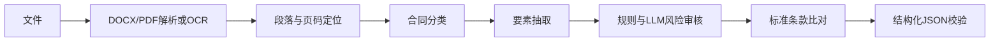

# A24 基于大模型的企业合同智能审核与风险预警系统

| 项目名称 | A24 基于大模型的企业合同智能审核与风险预警系统 |
|---|---|
| 文档名称 | AI服务接口文档 |
| 文档版本 | V0.1 |
| 文档状态 | 开发基线 |
| 创建日期 | 2026-07-11 |
| 主要负责人 | AI算法负责人：刘紫雯 |
| 参与人员 | 后端负责人：杨雨翰 |

## 修订记录

| 版本 | 日期 | 说明 | 修订人 |
|---|---|---|---|
| V0.1 | 2026-07-11 | 定义内部AI接口与结果契约 | 杨雨翰 |
| V0.1-r1 | 2026-07-11 | 统一风险规则参数、规则ID类型和定位输出 | 杨雨翰 |

## 1. 服务职责与调用规则

AI 服务提供 DOCX/PDF/图片解析、PaddleOCR、合同类型识别、关键要素抽取、风险审核、标准条款比对和完整审核。仅供业务后端调用，基地址为 `http://ai-service:8001/internal/v1`；使用 `X-Internal-Token` 鉴权，令牌来自环境变量。AI 服务不访问业务数据库、不暴露给浏览器。

每个请求必须带 `X-Request-Id`（`requestId`），业务后端以其实现幂等：同一 `requestId` 与相同文件版本返回同一已完成结果或处理中状态。默认连接超时 5 秒、读取超时 120 秒、最多重试：2次。仅网络异常、429、5xx 按指数退避最多重试2次；4xx、结构校验失败、解析失败不重试。记录模型名、模型版本、Prompt版本及处理耗时。

## 2. 接口清单

| 名称 | 方法/路径 | 请求内容 | 响应重点 |
|---|---|---|---|
| 健康检查 | GET `http://ai-service:8001/health` | 无 | `status,version`；不使用内部API前缀 |
| 文档解析 | POST `/documents/parse` | `contractId,filePath,fileType` | `text,segments,warnings`；`segments`含`text,page,paragraphIndex` |
| OCR识别 | POST `/documents/ocr` | `contractId,filePath` | `text,segments,warnings`；`segments`含`text,page,paragraphIndex` |
| 合同类型识别 | POST `/contracts/classify` | `contractId,text` | `contractType,typeConfidence` |
| 要素抽取 | POST `/contracts/elements` | `contractId,text,contractType` | `elements` |
| 风险审核 | POST `/contracts/risks` | `contractId,text,contractType,riskRules` | `risks,overallRiskLevel,overallScore` |
| 标准条款比对 | POST `/contracts/compare-clauses` | `contractId,text,standardClauses` | `missingClauses,deviations` |
| 完整审核 | POST `/reviews/full` | `contractId,filePath,fileType,standardClauses,riskRules` | 完整审核结果 |

`filePath` 为业务后端生成的受控服务内路径或共享卷路径，不接受来自浏览器的任意路径。请求 JSON 统一含 `requestId`；示例：

```json
{"requestId":"req_x","contractId":1001,"filePath":"/data/uploads/1001/a.pdf","fileType":"pdf","standardClauses":[],"riskRules":[]}
```

## 3. 完整审核结果契约

```json
{
  "requestId":"req_x",
  "contractId":1001,
  "contractType":"purchase",
  "typeConfidence":0.91,
  "elements":[{"elementType":"contractAmount","elementName":"合同金额","value":"100000.00","page":1,"paragraphIndex":8,"confidence":0.89}],
  "risks":[{"riskType":"unlimitedLiability","riskName":"无限责任","riskLevel":"high","clauseText":"...","page":3,"paragraphIndex":12,"basis":"风险规则 R001","suggestion":"约定责任上限","confidence":0.86,"ruleId":1}],
  "missingClauses":["disputeResolution"],
  "overallRiskLevel":"high",
  "overallScore":72.50,
  "modelName":"qwen",
  "modelVersion":"TBD",
  "promptVersion":"v0.1",
  "processingTimeMs":1234,
  "warnings":[],
  "error":null
}
```

`ruleId` 为 `risk_rule.id`（整数）；`basis` 可展示稳定的 `ruleCode`，例如 `R001`。未命中预定义规则而由模型识别时，`ruleId` 为 `null`。`confidence` 范围为 0 至 1；`overallScore` 为 0 至 100 的风险分值，计算规则为 TBD，展示时须说明其不等同于模型准确率。`modelVersion` 必须记录实际请求使用的模型标识； 若API未单独返回版本，则记录QWEN_MODEL环境变量的值。AI 输出先经 Pydantic 校验再返回业务后端；`error` 非空时不得将结果标记为成功。

## 4. AI处理管线



## 5. 模型、Prompt与可解释性

采用 Qwen API 与预定义规则库组合方案。Prompt 不写死密钥，版本号以 `promptVersion` 输出；规则命中需输出 `ruleId` 和依据，模型推断需写明模型依据并保留置信度。分类准确率≥85%、要素F1≥80%、风险精准率/召回率≥75%均为赛题**待评测目标**。评测数据、标注规范、阈值和最终版本号均为 TBD。
